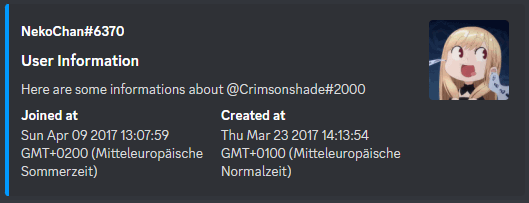

<!-- Image -->
<div align="center">
    <h1>はるか - HARUKA</h1>
    <a href="https://discord.gg/NAYNT2c77G">
        
    </a>
    <a href="https://discord.com/api/oauth2/authorize?client_id=1051546654249058455&permissions=8&scope=applications.commands%20bot">
        
    </a>
    <a href="https://www.patreon.com/crimsonshade">
        
    </a>
</div>
<div align="center">
    <a href="https://github.com/crimsonshade/haruka/issues">
        
    </a>
</div>

# Table of Content

- [General](#general)
- [Installation](#installation)
- [Current Commands](#current-commands)
    - [Info](#info)
    - [Ping](#ping)
    - [User](#user)
    - [Server](#server)
    - [Baka](#baka)
- [The Future](#future-of-the-bot)
- [Support and Issues](#support)

# General

This bot was created just for fun. I wanted to learn javascript a bit, and ended up with the fought "oh a discord bot would be cool!" So I started working on this one! Currently there aren't that much features, and the bot, or let's call her **Haruka** haha, is currently self hostes on my local machine. (So she isn't online for the longest time) <br/>
But I am looking for a solutionfor this problem!

# Installation

There are two ways to get the bot on your server. <br/>
The first one, is by simply [inviting](https://discord.com/api/oauth2/authorize?client_id=1051546654249058455&permissions=8&scope=applications.commands%20bot) the bot on your own server. This may be a bit boring, because the bot isn't running the hole time at this point.

The second one, is by selfhosting it. But this is for beginners a bit difficult. <br/>
**You have to have [nodejs](https://nodejs.org/en/) installed to do this one!** <br/>
Currently, you can install the bot, by cloning this repository, onto your local machine, and running the `npm install` command, to install all dependencies. After doing this, you have to create an discord bot application by your self, by visiting the [discord applications](https://discord.com/developers/applications), and clicking onto the **new Application** button. (Just type in a name, create the bot, and copy your bot token). 
After doing all of that, just open the folder, where you cloned this repo, create a .env file, and write following into this file
```JS
BOT_TOKEN=<your-token>
CLIENT_ID=<bot-client-id>
GUILD_ID=<your-server-id>
```

And thats everything you have to do! The last thing is to run the `npm run test` command in your command prompt (or your VisualStudio Code Terminal) and the bot should be running! (If something isn't working, just open an [issue](https://github.com/crimsonshade/haruka/issues) and let me know, what exactly isn't working)

# Current Commands
In here you can find a list of all commands of the bot, and how they work. (Some of them are maybe bit weard, and have to be reworked later on) All commands are slash commands `(/)`. So there is no prefix for this bot.

## Info
The `/info` command is the same like the `help` command (which doesn't exist right now) and displays not only a few infos about the bot, but also a brieve summary of the commands.
<div align="center">
    
</div>

## ping
The `/ping` command currently only replies with "Pong!". The latency has to be calculated later on.

## user
the `/user` command shows a few informations about the user who calls it. It's nothing special. Just one of the first commands I created for it, because of a tutorial, and I started working on it, and making it an embed and stuff like that, so I kept it. (and it's kinda cute to have haha)
<div align="center">
    
</div>

## server
the `/server` command **will be updated**. Currently, it's just plain text. Realy nothing special.

## anime
the `/anime` commands outputs a random image, using the [waifu.pics](https://waifu.pics/) API. If you use this command, you will have the choice between *sfw (safe for work)* and *nsfw (not safe for work)* images. You also get some options which are required(!) so the API call works fine. Down below is an image, of the options. Just start typing the option, and press enter if the one you want is selected.
<div align="center">
    
</div>

## baka
The `/baka` command also has an option for you you pick. But in this case, it is a Discord Channel. (Currently you can select *text channels* to, but I will remove this option later on). You just can pick a voicechannel with a few people in, and the bot, will pick someone inside, and call him a bakka! (means idiot on japanese) and don't mind the typo in the image. You write it if one k. (And yes this one was selected random xD)
<div align="center">
    
</div>

# Future of the bot
I will try to add stuff when I got the time to do it. Like I explained in the General Information, this was a fun project. I will definitly work on it, but I don't know for how long. But down here, I list some changes I wanne make later and let you know, if I did it!

| To do | Description |
|:-------:|:-----|
| `ping` | Calculate the latency of the user |
| `anime` | Add some funny text to the output. Like `@sender wants to **kiss** @target` |
| `server` | Make the server command look a bit fancier. |
| `baka` | Change the typos |
| `online` | Host the bot, so he is only all the time |
|  | more will be added later on |

# Support
If you find some typos in this text, please open an [issues](https://github.com/crimsonshade/haruka/issues) and let me know about it! <br />

If you like the bot, and want to support me, check out my [Patreon](https://github.com/crimsonshade/haruka/issues). Maybe I will add some presents later, when the bot has more features.

If you wanne see some of myself, just checkout my [socials](https://socials.crmsn.xyz) page.